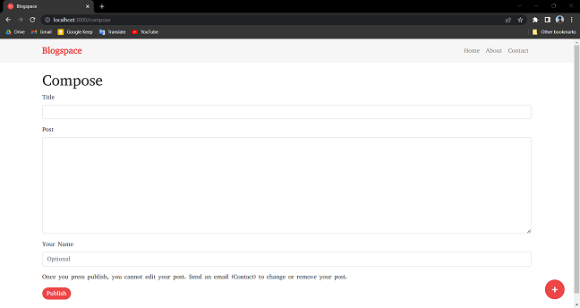

# Blogspace Project

This blog website is developed using NodeJS, ExpressJS and EJS template.

## Features

- Write blog or experience in website
- No need to mention name to keep your blog private

## Link to the Website

- https://blogspace-ahwy.onrender.com
- Youtube Link

## Tech

- **Client** : EJS, Bootstrap
- **Server** : Node, Express, Mongoose
- **Database** : MongoDB

## Screenshots





## Installation

- Clone the Repository
- Use below commands:
	1. ```npm install```
	2. ```npm run start```

## Environment Variables

```MONGO_URL```
